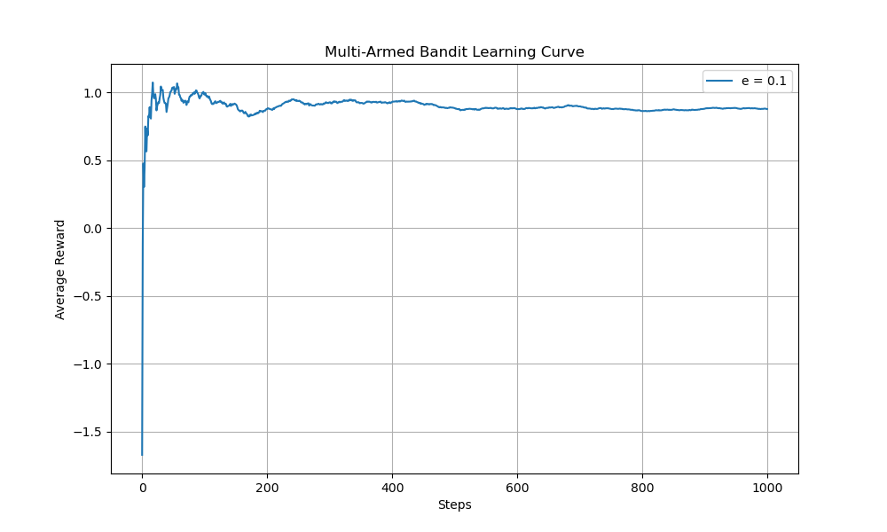
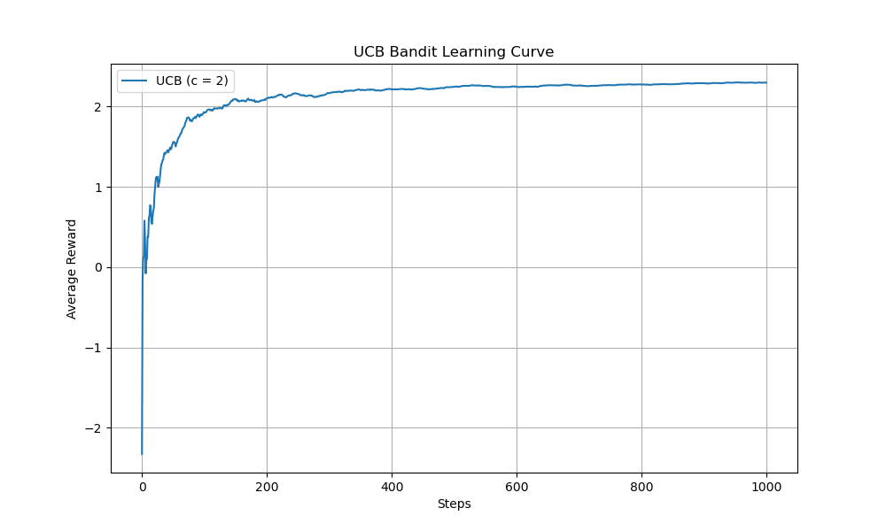
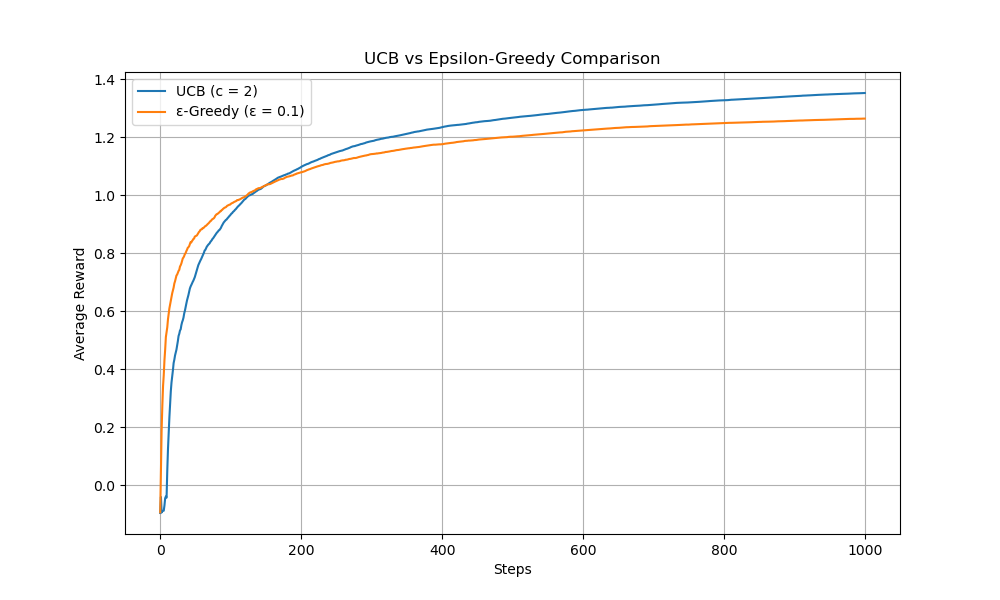
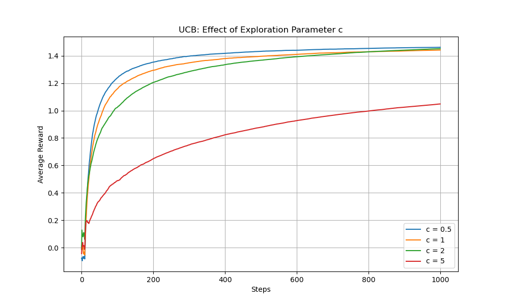

# AI Research Log

## Phase 0 : Foundation Summer (May 2026)

### [2026-05-27] Day 1: Environment & First simulation
* **Random Policy :** Using 'env.action_space.sample()' resulted in failure to balance the pole within 10 to 15 steps. The agent has no "spatial awareness".
* **Human logic(Heuristic) Policy :** By implementing the a simple 'if' based condtion-'if angle > 0 , move right' - 'else move left', the agents performance was slightly improved.
* **Key Insights** Goal is to build an agent that can discover these rules mathematically from the raw data instead of us hard coding the rules directly.

### [2026-05-28] Day 2: Understanding Neural Network Mechanics

* **Mathematical Breakthrough (The Mapping Concept):**
    * Refined the understanding of the Policy Matrix equation: $M \cdot \vec{s} = \vec{v}$.
    * **The Input:** $\vec{s}$ is the 4D State Vector representing environmental conditions.
    * **The Transformation ($M$):** Actively "warps" and weights these dimensions based on their importance (e.g., heavily weighting pole angle over cart position).
    * **The Output ($\vec{v}$):** A 2D "Score Vector" (or Action-Value vector) where each index corresponds to an action: $[Score_{Left}, Score_{Right}]$.
    * **Decision Rule:** The agent evaluates this generated vector and chooses the action with the maximum score. 
    * **Core Research Problem:** "Learning" is simply the optimization process of finding the exact numerical values inside Matrix $M$ that consistently produce the highest scores for successful survival actions.

### [2026-05-29] Day 3: Sutton & Barto Chapter 1 — Foundational Definitions

#### The Agent-Environment Feedback Loop
The foundation of Reinforcement Learning is the continuous interaction between the decision-maker (the agent) and the world it interacts with (the environment).
* **State ($s$):** The raw data or observation received by the agent. In CartPole, this is a 4D vector: `[Cart Position, Cart Velocity, Pole Angle, Pole Angular Velocity]`.
* **Action ($a$):** The decision executed by the agent in response to the state. 
* **Result ($s'$):** The environmental change resulting from the action taken.

#### Core Subelements Breakdown
* **Reward Signal ($r$):** The numerical feedback given per timestep. In CartPole, the agent receives +1 for every frame the pole remains upright. 
* **Return ($G$):** The mathematical definition of "lifespan" or success, calculated as the sum of all rewards accumulated over time. 
* **Policy ($\pi$):** The mechanism defining how an agent chooses an action based on what it sees. 
* **Optimal Policy ($\pi^*$):** A mathematical mapping from raw state data to actions that keeps the system stable indefinitely and maximizes the cumulative reward.

### [2026-06-01] Day 4: Multi-Armed Bandit Simulation (Epsilon-Greedy)

#### 1. Problem Definition
Implemented a **10-Armed Bandit Testbed**. In this environment:
- There are $k=10$ actions (arms).
- Each arm has a hidden reward distribution (stationary).
- The agent must estimate the value of each arm ($q_*$) to maximize total reward.

#### 2. Mathematical Implementation
I implemented the **Simple Average Action-Value Method** using the incremental update rule to optimize memory efficiency:

$$Q_{n+1} = Q_n + \frac{1}{n} [R_n - Q_n]$$

- **Exploration strategy:** $\epsilon$-greedy ($\epsilon = 0.1$).
- **Reward Logic:** $R \sim \mathcal{N}(q_*(a), 1)$.

#### 3. Engineering & Troubleshooting
- **Environment Management:** Encountered dependency conflicts with Python 3.13 and Conda. Resolved by creating a dedicated `rl_basics` environment using **Python 3.12**, which is more stable for scientific libraries like Matplotlib.
- **Data Visualization:** Fixed an indentation bug where rewards were recorded outside the loop. Implemented **Cumulative Moving Average** plotting to filter out normal distribution noise and visualize the true learning trend.

#### 4. Key Takeaways
- **Exploitation** is necessary to maximize reward, but **Exploration** is mandatory to ensure the agent doesn't settle for a "local optimum" (a good arm that isn't the *best* arm).
- A flat graph at zero is usually a symptom of improper data logging/loop scope, not necessarily a failure of the RL algorithm itself.

### 5. Validation Result
- **True Best Arm Index:** [2]
- **Agent's Predicted Best Arm:** [2]
- **Status:** Convergence Successful. 
- **Observation:** The estimated Q-values are remarkably close to the true values, proving the effectiveness of the incremental update rule.

### 6. Graph plot / Result

### [2026-06-02] Day 5: Upper Confidence Bound (UCB) Algorithm

#### 1. Problem Definition
Implemented the **Upper Confidence Bound (UCB)** algorithm for the 10-Armed Bandit problem. UCB improves upon simple greedy strategies by incorporating an "Optimism in the Face of Uncertainty" principle.

#### 2. Mathematical Implementation
UCB balances **Exploitation** (choosing the arm with the current highest Q-value) and **Exploration** (choosing uncertain arms) using the following formula:

$$UCB(a) = Q(a) + c \sqrt{\frac{\ln(t)}{N(a)}}$$

- $Q(a)$: Current estimated value of the arm.
- $N(a)$: Number of times the arm has been pulled.
- $t$: Total number of steps.
- $c$: Exploration parameter (set to 2 for this simulation).

#### 3. Engineering & Troubleshooting
- **Division by Zero:** Handled the initial state where $N(a) = 0$ by implementing a "Warm-up" phase that pulls each arm once before applying the UCB formula.
- **Numerical Stability:** Ensured $t$ (total steps) was cast to a float during division to avoid integer arithmetic errors.
- **Performance Analysis:** Extended the simulation to 1000 steps and averaged over 200 runs to generate statistically significant learning curves.

#### 4. Key Takeaways
- **UCB vs. ε-Greedy:** UCB consistently outperforms $\epsilon$-Greedy (at $\epsilon=0.1$) because it intelligently allocates exploration to arms that are *promising* but *under-explored*, rather than exploring randomly.
- **The Role of $c$:**
    - Low $c$ (e.g., 0.5): Behaves almost like a greedy algorithm, risks missing the best arm.
    - High $c$ (e.g., 5): Explores too much, wasting steps on inferior arms.
    - Optimal $c \approx 2$ provides a good balance for this specific reward distribution.

### 5. Validation Result
- **Convergence:** The agent successfully converged to the optimal arm (Arm 2).
- **Performance:** Achieved a significantly higher cumulative average reward compared to standard $\epsilon$-Greedy in the comparative simulation.

### 6. Graph plot / Result

